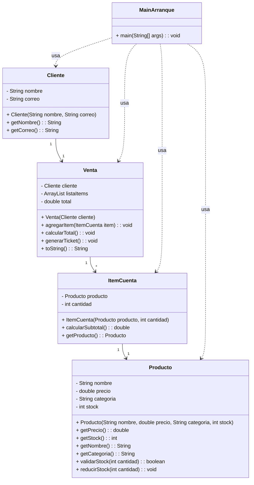

# 4A. Sistema para la tienda departamental Dreams
Módulo 4. Programación con Java
### Alumno: Vázquez Cosetl, Leonardo Rashitt

## Introducción
El presente trabajo tiene como objetivo aplicar los principios de la Programación Orientada a Objetos (POO) para diseñar un sistema que gestione las operaciones básicas de una tienda departamental llamada Dreams. El sistema permite registrar productos, administrar clientes y realizar ventas controlando el stock disponible.

## Desarrollo
### 1. Análisis
- Se aplicaron los conceptos de clase, objeto, atributos, métodos, encapsulación y herencia.
- Se crearon tres clases principales: Producto, Cliente, Venta e ItemCuenta.
- Cada clase tiene atributos (características), constructores y métodos (comportamientos).
- Además, se implementó una clase principal para que interactúen entre sí los objetos.

### 2. Identificación de Clases y Objetos
- **Clase Producto** → Representa los artículos en venta (ejemplo: camisa, perfume).
- **Clase Cliente** → Representa a los compradores (ejemplo: Laura Pérez).
- **Clase Venta** → Registra las transacciones realizadas entre clientes y productos.
- **Clase ItemCuenta** → Me permite validar la disponibilidad de un producto.
- **Clase MainArranque** → Es la clase principal que ejecuta el programa.


### 3. Definición de Atributos y Métodos
| Clase       | Atributos                                                                 | Métodos principales                                                                 |
|--------------|---------------------------------------------------------------------------|-------------------------------------------------------------------------------------|
| **Cliente**  | - nombre: String<br>- correo: String                                      | + Cliente(String, String)<br>+ getNombre(): String<br>+ getCorreo(): String         |
| **Producto** | - nombre: String<br>- precio: double<br>- categoria: String<br>- stock: int | + Producto(String, double, String, int)<br>+ getPrecio(): double<br>+ getStock(): int<br>+ getNombre(): String<br>+ getCategoria(): String<br>+ validarStock(int): boolean<br>+ reducirStock(int): void |
| **ItemCuenta** | - producto: Producto<br>- cantidad: int                                 | + ItemCuenta(Producto, int)<br>+ calcularSubtotal(): double<br>+ getProducto(): Producto |
| **Venta**    | - cliente: Cliente<br>- listaItems: ArrayList\<ItemCuenta\><br>- total: double | + Venta(Cliente)<br>+ agregarItem(ItemCuenta): void<br>+ calcularTotal(): void<br>+ generarTicket(): void<br>+ toString(): String |
| **MainArranque** | *(Sin atributos)*                                                     | + main(String[] args): void                                                        |


### 4. Relación entre Clases

- Cada Venta está asociada a un Cliente y a varios ItemCuenta.
Esto significa que una venta pertenece a un cliente específico y contiene una lista de productos con sus cantidades.

- La clase ItemCuenta actúa como un vínculo intermedio entre Venta y Producto.
Cada ItemCuenta representa un producto individual dentro de la venta e incluye la cantidad comprada.
Gracias a esta relación, una venta puede tener múltiples productos distintos.

- Producto y Cliente son clases independientes.
No dependen entre sí ni se conocen directamente. Sin embargo, ambas son utilizadas por Venta para representar una compra completa.

- La clase Producto administra su propio stock.
A través de los métodos validarStock() y reducirStock(), controla si hay existencias suficientes y actualiza el inventario cuando un producto se vende.

- La clase Venta se encarga de calcular el total de la compra y generar el ticket.
Usa los subtotales de cada ItemCuenta para obtener el monto total y muestra los productos comprados por el cliente.

- La clase MainArranque es el punto de entrada del programa.
Es la encargada de crear los objetos (Producto, Cliente, ItemCuenta, Venta), enlazarlos y ejecutar la lógica completa de la simulación de compra.


### 5. Diagrama de Clases UML


### 6. Código
```

```

### 7. Conclusiones
- La práctica permitió aplicar los conceptos de encapsulamiento, composición y asociaciones entre clases.
- Se corrigió un error en la clase Venta que reiniciaba la lista de productos en cada agregado.
- Con la clase MainArranque entendí la diferencia entre una asociación (relación permanente) y una dependencia (uso temporal).
- El diagrama final muestra las relaciones entre Cliente, Producto, ItemCuenta, Venta y MainArranque.


### Preguntas de reflexión
1. ¿Cómo se relacionan las clases entre sí? `Las clases Cliente y Producto son independientes, pero ambas se relacionan a través de Venta, que actúa como enlace entre ellas.
La clase MainArranque no forma parte de la relación entre objetos, sino que se encarga de crear las instancias y ejecutar la lógica principal del programa.`

2. ¿Qué benefi cios aporta la POO en el diseño? `Permite modularidad, reutilización de código y facilidad para mantener y escalar el sistema.`

3. ¿Cómo se podría garantizar la precisión en el cálculo de las ventas? `Verifi cando el stock antes de realizar la venta y utilizando métodos que calculen automáticamente el total y validando que no se agreguen cifras negativas.`

4. ¿Qué mecanismos de la POO se podrían utilizar para reutilizar atributos y métodos? `La herencia permite compartir atributos y comportamientos comunes entre clases, mientras que la encapsulación protege los datos y promueve su uso controlado mediante métodos públicos.`

5. ¿Qué patrón de diseño sería adecuado para gestionar las ventas? `Podría usarse el patrón MVC (Modelo-Vista-Controlador) para separar la lógica de negocio de la interfaz de usuario.`

6. ¿Qué estrategias se podrían implementar si un cliente intenta comprar sin stock sufi ciente? `Mostrar un mensaje de error y evitar que la venta se registre hasta que haya disponibilidad.`


## Conclusión general

El ejercicio permitió aplicar los principios fundamentales de la POO, mostrando cómo las clases pueden representar entidades reales y trabajar de forma conjunta. Logré estructurar un sistema funcional y organizado para una tienda departamental que gestiona productos, clientes y ventas.
Ha sido muy retador para mí entender cómo traducir a código lo que ya me quedó claro a nivel conceptual, especialmente en la parte de constructores y cómo instanciar objetos correctamente. Sin embargo, esta práctica me ayudó a comprender mejor cómo interactúan las clases entre sí.